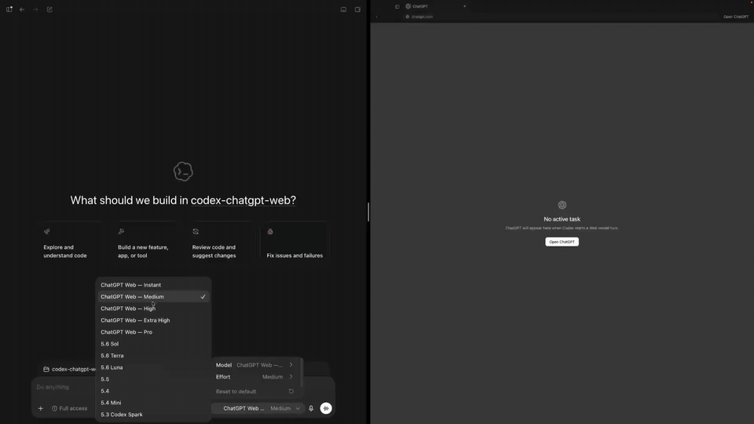
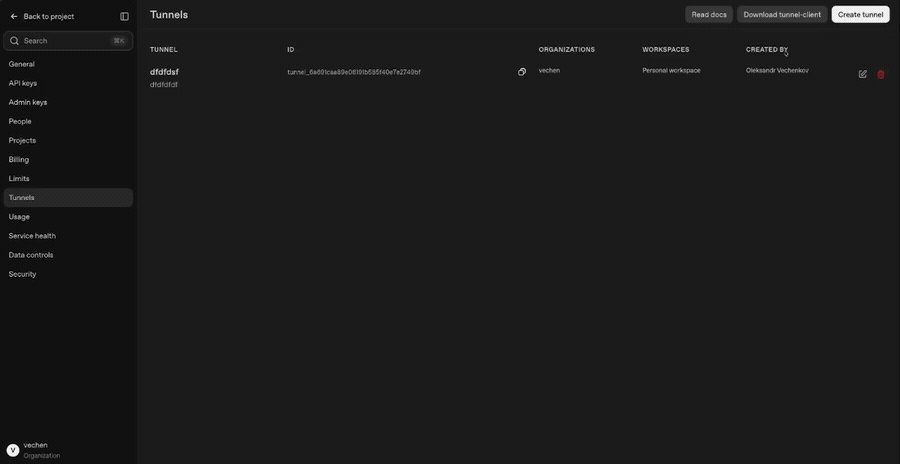
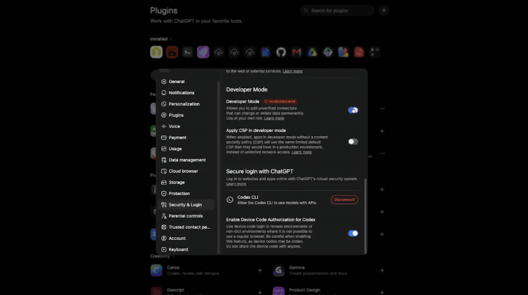

# Code ProMax

[Tiếng Việt](README.md) · [English](README.en.md)

Code ProMax is a proprietary desktop application that connects a local Codex workflow with ChatGPT Web while keeping the Codex task, project context, tool lifecycle, and local workspace on your computer.

> **Unofficial third-party software.** Code ProMax is not affiliated with, endorsed by, or sponsored by OpenAI.

## Demo

<p align="center">
  
</p>

## Main features

- **ChatGPT Web inside a Codex workflow** — use the ChatGPT models available to your account from the Codex task flow instead of managing a separate API-based model session.
- **Embedded ChatGPT sign-in** — authentication stays inside the launcher-owned browser profile.
- **Chat Long** — long-running, project-aware sessions with persistent task history and project context.
- **Work** — project-focused Codex workspace for larger coding and multi-step tasks.
- **Quick Chat** — a lighter standalone chat path for fast questions that do not need project access.
- **Project folder management** — projects can be moved to a new folder while preserving historical path aliases and previous threads.
- **Images and rich task context** — images and compiled Codex context can travel with the active task.
- **MCP / local tools** — supported configurations can connect ChatGPT back to the active local Codex tool harness.
- **Secure MCP Tunnel support** — Code ProMax can use OpenAI's Secure MCP Tunnel flow for private/local MCP connectivity where the account/workspace supports it.
- **Local diagnostics** — runtime health checks, logs, smoke tests, cancellation controls, and explicit errors when a required capability is unavailable.
- **Multiple model tiers** — the launcher exposes the ChatGPT model/mode choices actually available to the signed-in account.

The MCP tunnel portion uses OpenAI's documented Secure MCP Tunnel model, where the customer-run tunnel client keeps an outbound connection and the private MCP server does not need a public inbound port. See the official OpenAI `tunnel-client` documentation for the current platform requirements and availability.

## Installation

### Windows

1. When a production-signed build is available, open this repository's **Releases** page.
2. Download the latest production-signed Windows installer named similar to:

   ```text
   code-promax-<version>-win-x64.exe
   ```

3. Run the installer.
4. Start **Code ProMax**.
5. Sign in to ChatGPT inside the embedded browser using your own account.
6. Run the browser/runtime verification shown by the app.
7. Install/enable the Codex integration when prompted.
8. Restart Codex if the app asks you to, then select the ChatGPT Web model exposed by Code ProMax.

If Windows SmartScreen or another security product blocks an installer, verify that you downloaded it from this repository's official Releases page and check the published file/signature before continuing. Do not download builds from mirrors you do not trust.

## Basic usage

1. Open Code ProMax and confirm your ChatGPT session is signed in.
2. Open or select the project you want to work on.
3. Choose the workflow that matches the task:
   - **Quick Chat** for short questions without project access.
   - **Chat Long** for longer project-aware conversations and persistent history.
   - **Work** for substantial coding/research work against the selected project.
4. Choose a ChatGPT Web model/mode that your account currently exposes.
5. Start the task from Codex normally. Code ProMax handles the browser/model bridge and streams the result back into the Codex task.

Your available models, limits, UI, and connector capabilities depend on the ChatGPT account/workspace you sign in with and may change when OpenAI changes its products.

## Optional: MCP / local tool access

Some workflows can connect ChatGPT to the active local Codex tool harness through MCP. Code ProMax includes guided setup for this path.

<p align="center">
  
</p>

<p align="center">
  
</p>

OpenAI documents Developer Mode / MCP apps and its Secure MCP Tunnel client separately. Those platform features, account eligibility, permissions, and UI can change independently of Code ProMax.

Useful official references:

- OpenAI Secure MCP Tunnel client: https://github.com/openai/tunnel-client
- ChatGPT Developer Mode and MCP apps: https://help.openai.com/en/articles/12584461-developer-mode-and-mcp-apps-in-chatgpt

## Account risk and responsibility

Code ProMax interacts with ChatGPT through your own account. There is **no guarantee that using any third-party automation or integration is risk-free for an account**.

The developer's own experience is that Code ProMax has been used for months, on multiple computers, with ChatGPT Plus accounts without those accounts being disabled as a result of that testing. **That is only an anecdotal experience, not a guarantee that the same outcome will apply to every user, account, usage pattern, region, workspace, or future OpenAI policy.**

A ChatGPT account can encounter restrictions, verification requests, temporary limitations, suspension, or other problems for many different reasons. Depending on the situation, those reasons may relate to account security, billing, policy enforcement, unusual activity, usage patterns, workspace rules, product changes, or other factors. If an account issue happens while Code ProMax is installed, that timing alone does not prove that Code ProMax caused it.

Parts of Code ProMax integrate with capabilities documented by OpenAI, including MCP-related functionality and Secure MCP Tunnel where available. However, the ChatGPT Web bridge itself is an **unofficial third-party integration** and is not an OpenAI-supported guarantee of account safety or continued compatibility.

By using Code ProMax, you are responsible for:

- complying with the OpenAI terms, policies, and workspace rules that apply to your account;
- choosing how aggressively and how frequently you automate tasks;
- reviewing tool permissions before allowing local write/modify actions;
- protecting your own ChatGPT account and credentials;
- keeping backups of important project files before allowing automated code changes; and
- deciding whether the operational/account risk is acceptable for your use case.

**Code ProMax and its developer are not responsible for suspension, restriction, loss of access, rate limits, account review, billing issues, or other ChatGPT account problems where the cause may depend on OpenAI systems, user behavior, account state, policy enforcement, or other circumstances outside the application's control.** Nothing in this notice overrides rights or liabilities that cannot legally be excluded.

## Privacy and security notes

- ChatGPT prompts are still processed by OpenAI; Code ProMax is not local AI inference.
- Do not treat Temporary Chat or an embedded browser session as anonymity.
- Keep your operating system and Code ProMax installation updated.
- Install only builds from the official repository/release source you trust.
- Review MCP/tool permissions carefully before enabling write or modify actions.
- The application should never require you to publish private project source code to this GitHub repository in order to use the desktop app.

## Troubleshooting

If setup fails:

1. Confirm ChatGPT opens and is signed in inside Code ProMax.
2. Run the app's runtime/browser verification or doctor check.
3. Restart Code ProMax and Codex after changing integration settings.
4. If using MCP, verify that the tunnel/connector is available to the same OpenAI/ChatGPT environment you configured.
5. Check local logs for an explicit capability, permission, browser-UI, or network error before retrying repeatedly.

Because ChatGPT's web UI and platform capabilities can change, a future OpenAI update can temporarily break browser automation or connector behavior even when Code ProMax itself has not changed.

## Releases and updates

Production-signed binaries are distributed through this repository's **Releases** section when a release is published. The source code for Code ProMax is not published here.

Before installing an update, prefer the production-signed installer and any checksum/signature information supplied with that release.

## License

Code ProMax itself is proprietary software. See [LICENSE](LICENSE).

The application includes third-party open-source components distributed under their own licenses. Their notices and attribution are provided in:

- [THIRD_PARTY_NOTICES.txt](THIRD_PARTY_NOTICES.txt)
- [Bun.md](Bun.md)

Third-party components keep their original license rights and are not relicensed under the Code ProMax proprietary license.

## Trademark notice

Code ProMax is an independent third-party application and is not affiliated with, endorsed by, or sponsored by OpenAI. OpenAI, ChatGPT, GPT, Codex, and related marks belong to their respective owners.
